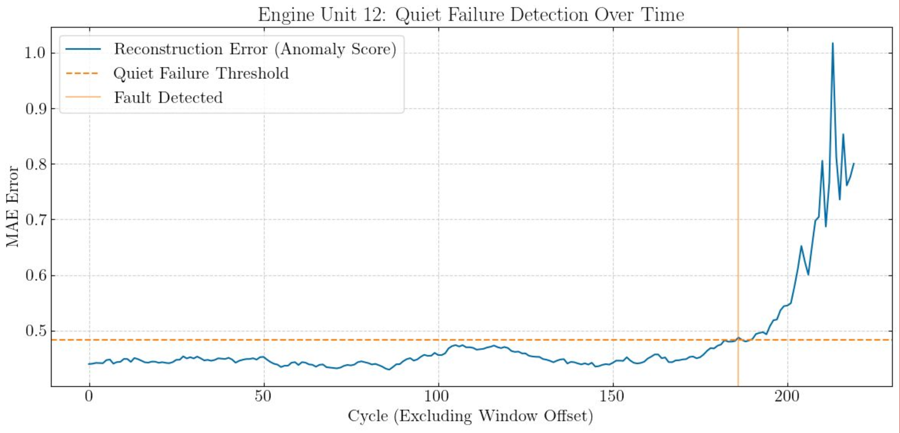

# HackAI 2026 | Unsupervised LSTM Autoencoder for Jet Engine Fault Detection

___

### Team

<u>NaN:</u> Neil Ghugare, Nishanth Kunchala, and Jacob Balek

___

### Acknowledgements

The data was collected on Kaggle, taken from a NASA dataset, located [here](https://www.kaggle.com/datasets/palbha/cmapss-jet-engine-simulated-data?select=test_FD004.txt).

The original NASA dataset file on their website can also be found [here](https://data.nasa.gov/dataset/cmapss-jet-engine-simulated-data).

___

### Motivation

Commercial aircraft engines face damages during flight, commonly known as "faults". Faults can range from microscopic cracks in fan blade, to bigger dents, to volcanic ash coating the compressor, or to electrical failures. Faults are often silent and can be difficult to detect, even with routine maintenance.

Airplane engines can operate for many cycles after the inital fault, and it is common for this initial fault to go unnoticed after its initial occurrence. 

> [!IMPORTANT] 
> This leads to the important distinction which we use throughout this project:
> * *Failure*: The official failure of the engine, where it can no longer function properly, and requires maintenance, downtime, or replacement.
> * *Fault*: The point where the engine firsts develops a fault (sometimes silently), where there is some issue with the engine, but the engine is still able to run. The engine will run after developing a fault, until the fault eventually worsens, thus causing engine failure.

According to industry estimates, unplanned downtime costs the global aviation sector billions of dollars a year, a considerable portion of this being due to engine issues. Early and accurate fault detection can help cut these costs and help reduce unplanned downtime.

___

### Handling The Data & The Model

For more information on how we handled this data and how we created the model, see the [presentation](https://github.com/RandomKiddo/HackAI2026/blob/master/Presentation.pdf) or the [project file](https://github.com/RandomKiddo/HackAI2026/blob/master/src/Project.ipynb).

For this project, on the most realistic dataset (FD004), we created a model that takes into account important operational settings and sensors, using `K-Clusters` to group the data. We then pass in the pre-processed, "healthy" engine data into an `LSTM` Autoencoder with a fixed window size to then return a reconstruction loss baseline that represents "normal operating" loss of the engine. We can then use that on the test set to check if a fault occurs.

___

### Predicting Faults

As the autoencoder processes each window of data, it calculates the reconstruction loss. Relative to the normal operating loss of this class of engines we find, we define the quiet failure threshold and check if the reconstruction loss ever passes that threshold. In the example provided, we see that a fault is predicted on this engine at around 180 cycles (excluding the offset given by the window size). 

___

This page was last edited on 03.06.2026.
